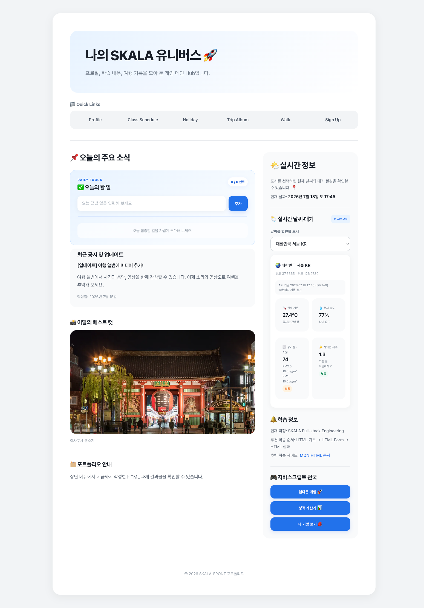
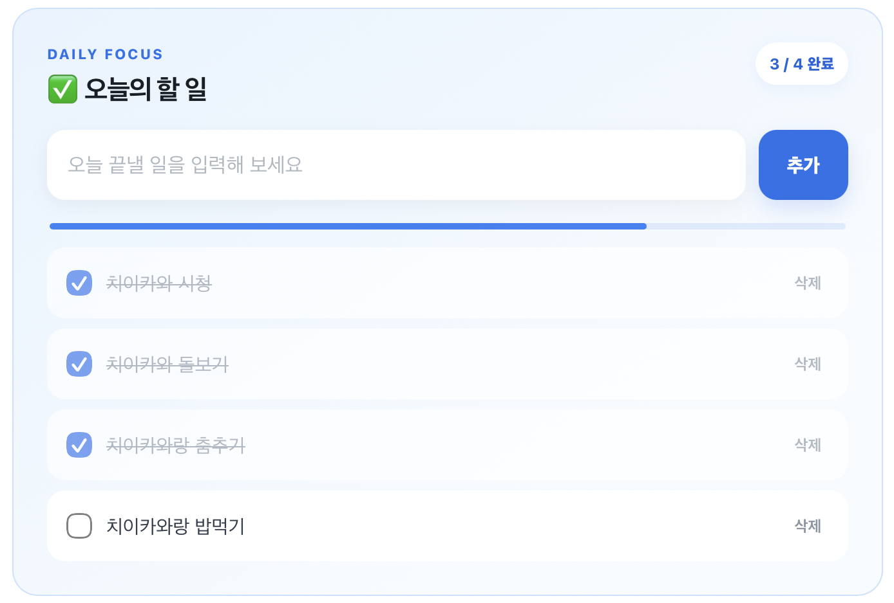
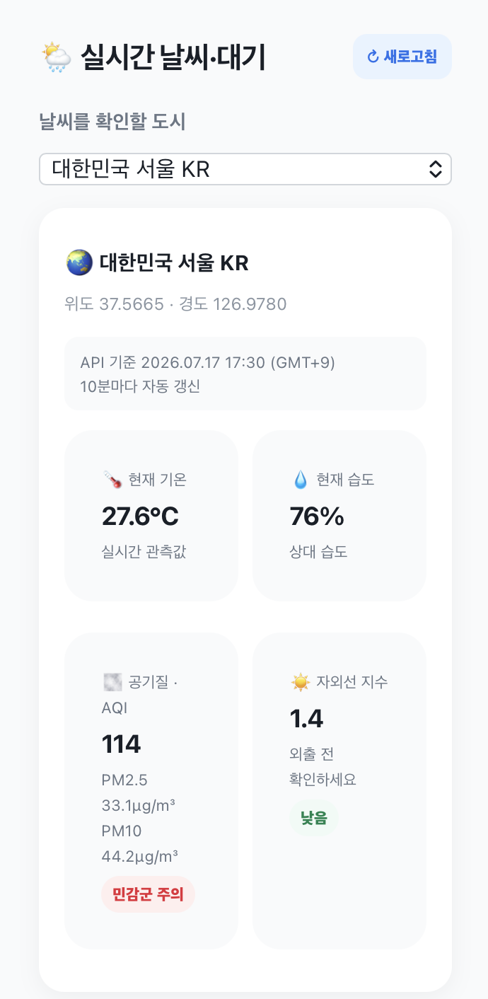
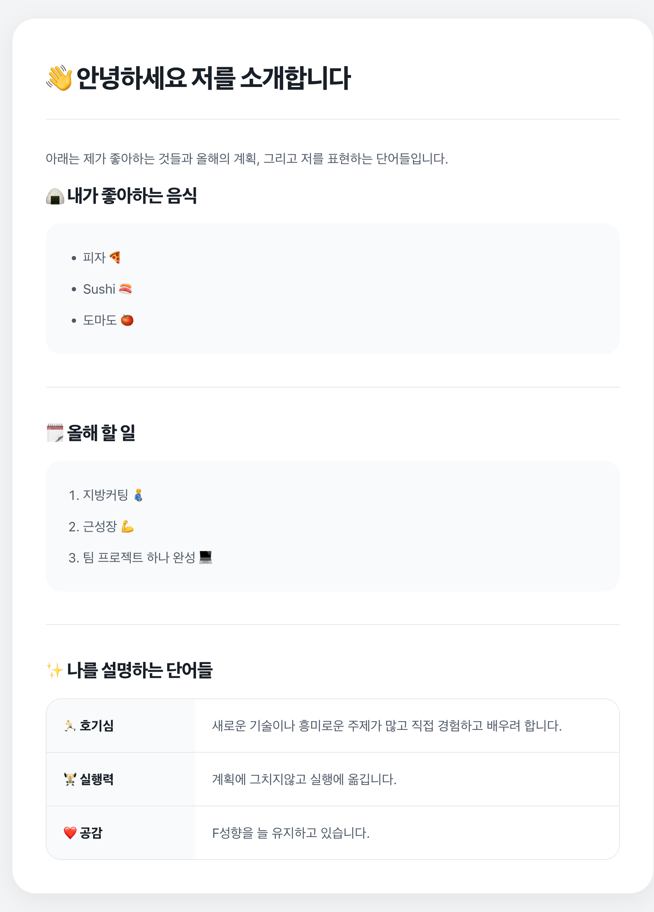
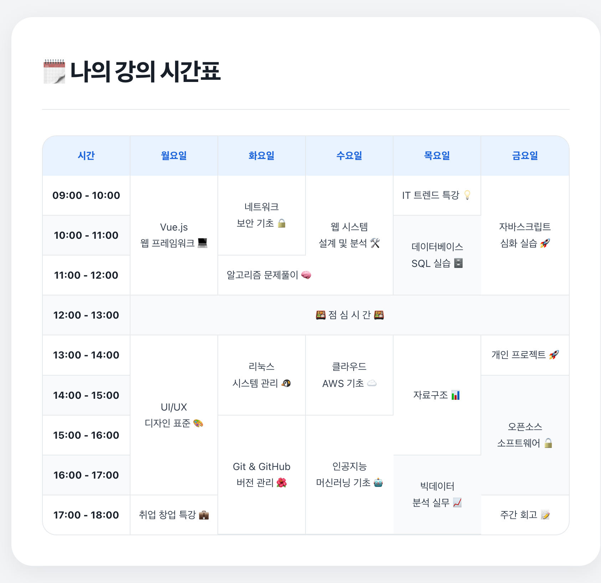
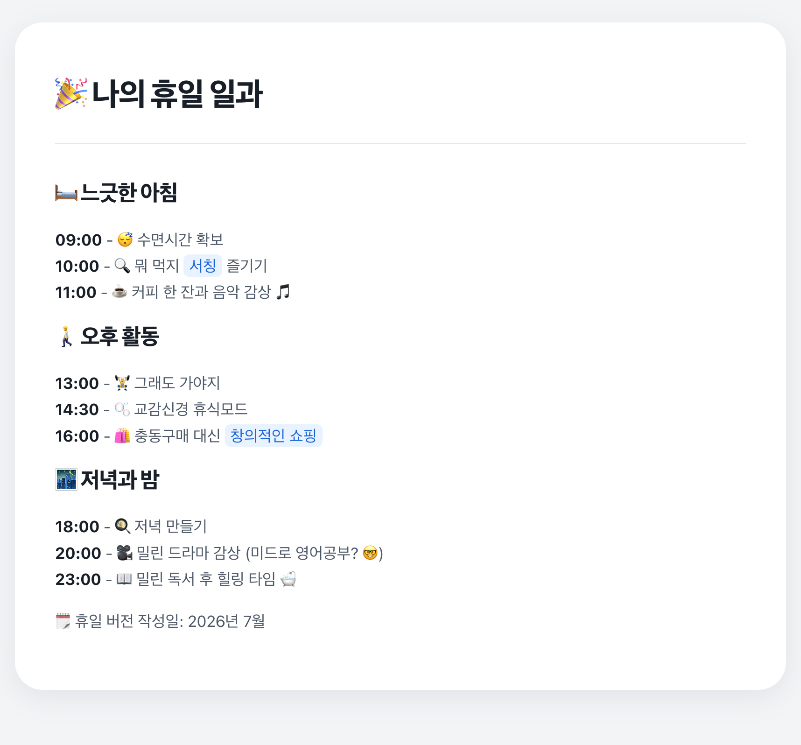
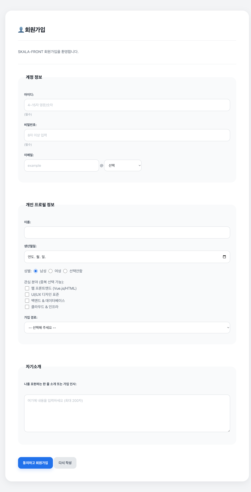
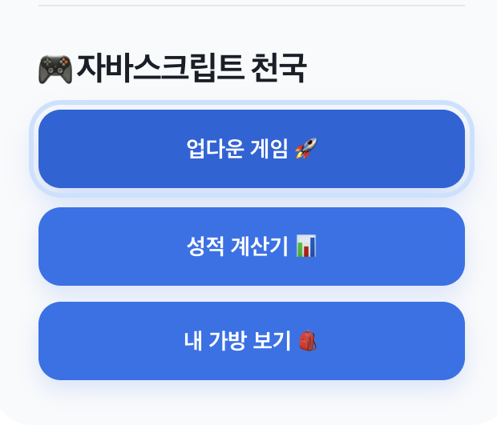

# SKALA-FRONT


HTML, CSS, JavaScript를 학습하며 만든 개인 웹사이트입니다. 여러 HTML 페이지를 하나의 Main Hub로 연결하고, 체크리스트와 산책 코스, 날씨·대기 정보 등의 기능을 구현했습니다.

## 프로젝트 소개

- 시맨틱 HTML을 이용한 페이지 구성
- Flexbox, Grid, 미디어 쿼리를 이용한 반응형 레이아웃
- DOM 이벤트와 배열 데이터를 이용한 화면 생성
- `localStorage`를 이용한 할 일과 관심 코스 저장
- `fetch()`와 ES Module을 이용한 Open-Meteo API 연동

## 주요 기능

### 1. Main Hub

- Profile, Class Schedule, Holiday, Trip Album, Walk, Sign Up 페이지 연결
- 화면 너비에 따라 카드 배치가 바뀌는 반응형 레이아웃
- 모든 하위 페이지에서 Main Hub로 이동 가능

<p align="center">
  
</p>

### 2. Tokyo Walk Note

- 아사쿠사와 스미다강, 우에노 공원과 아메요코, 도쿄 디즈니씨 코스 제공
- 지역과 분위기에 따른 코스 필터
- 관심 코스를 브라우저에 저장하는 기능
- 코스별 사진 5장을 버튼, 점, 방향키, 스와이프로 넘기는 Carousel
- `<dialog>`를 이용한 상세 게시글 표시

<p align="center">
  
  
  
</p>

산책 사진의 원본과 라이선스는 [`media/ATTRIBUTIONS.md`](media/ATTRIBUTIONS.md)에 정리했습니다.

### 3. 오늘의 할 일

- 할 일 추가, 완료 체크, 개별 삭제
- 완료 개수와 진행률 표시
- 날짜별 목록을 `localStorage`에 저장

<p align="center">
  
</p>

### 4. 날씨·대기 정보

- 서울, 광주, 도쿄, 파리의 현재 기온과 습도 표시
- PM2.5, PM10, AQI, 자외선 지수 표시
- 선택 도시의 현지 날짜와 시각 적용
- 10분 자동 갱신, 수동 새로고침, 로딩·오류 상태 안내

<p align="center">
  
</p>

### 5. Profile

- 좋아하는 음식과 올해의 목표 목록
- 설명 목록을 이용한 관심사와 특징 정리

<p align="center">
  
</p>

### 6. Class Schedule · Holiday

- `table`, `rowspan`, `colspan`을 이용한 주간 시간표
- 시간대별 휴일 활동 구성
- 작은 화면에서 시간표 좌우 스크롤 지원

<p align="center">
  
  
</p>

### 7. Trip Album · Media

- 여행 사진을 Grid 카드로 배치
- HTML `<audio>`, `<video>` 요소를 이용한 미디어 재생

<p align="center">
  
</p>

### 8. Sign Up Form

- 아이디, 비밀번호, 이메일, 생년월일 입력
- 이메일 도메인 선택 및 직접 입력
- HTML Form 유효성 검사 속성 적용

<p align="center">
  
</p>

### 9. JavaScript 미니 기능

- 업다운 숫자 맞히기 게임
- 점수에 따른 성적 계산기
- 객체로 만든 가방 속 물품 확인

<p align="center">
  
</p>

## 사용 기술

| 구분 | 사용 기술 | 적용 내용 |
| --- | --- | --- |
| Markup | HTML5 | 시맨틱 태그, 목록, 표, Form, Dialog, 오디오, 비디오 |
| Styling | CSS3 | CSS 변수, Flexbox, Grid, 미디어 쿼리, 애니메이션 |
| Programming | JavaScript | DOM, 이벤트, 배열, 객체, 모듈, `localStorage` |
| Async | Fetch API | `async/await`, `Promise.all()`, 오류 처리 |
| Open API | Open-Meteo | 날씨, 습도, 미세먼지, AQI, 자외선 |
| Development | VS Code Live Server | 로컬 웹 서버 실행 |

## 프로젝트 구조

```text
SKALA-FRONT/
├── README.md
├── css/
│   └── style.css
├── docs/
│   └── images/
│       ├── 01-main.png
│       ├── 02-weather-air.png
│       ├── 03-profile.png
│       ├── 04-class.png
│       ├── 05-holiday.png
│       ├── 06-trip.png
│       ├── 07-signup.png
│       ├── 08-javascript.png
│       └── 09-todo.png
├── html/
│   ├── index.html
│   ├── myClass.html
│   ├── myHoliday.html
│   ├── myProfile.html
│   ├── myTrip.html
│   ├── signUp.html
│   ├── signUpResult.html
│   └── walk.html
├── media/
│   ├── ATTRIBUTIONS.md
│   ├── asakusa.jpg
│   ├── disneysea.jpeg
│   ├── music.mp3
│   ├── myTrip-asakusa01.jpg
│   ├── myTrip-asakusa02.jpg
│   ├── myTrip-asakusa03.jpg
│   ├── myTrip-asakusa04.jpg
│   ├── myTrip-asakusa05.jpg
│   ├── tokyo-station.jpeg
│   ├── video.mp4
│   ├── walk-disney01-soaring.jpg
│   ├── walk-disney02-peterpan.jpg
│   ├── walk-disney03-sindbad.jpg
│   ├── walk-disney04-frozen.jpg
│   ├── walk-disney05-rapunzel.jpg
│   ├── walk-ueno01-museum.jpg
│   ├── walk-ueno02-geidai.jpg
│   ├── walk-ueno03-ameyoko.jpg
│   ├── walk-ueno04-hinoya.jpg
│   └── walk-ueno05-izakaya.jpg
└── script/
    ├── airQualityAPI.js
    ├── bag.js
    ├── grade.js
    ├── realtimeInfo.js
    ├── todo.js
    ├── upDown.js
    ├── walkBlog.js
    └── weatherAPI.js
```

## 주요 파일 역할

| 파일 | 역할 |
| --- | --- |
| `html/index.html` | Main Hub, 체크리스트, 실시간 정보, 미니 기능 표시 |
| `html/walk.html` | 산책 코스 목록, 필터, 상세 Dialog 영역 |
| `css/style.css` | 전체 페이지의 공통 스타일과 반응형 레이아웃 |
| `script/todo.js` | 날짜별 할 일 생성·완료·삭제·저장 |
| `script/walkBlog.js` | 산책 데이터, 필터, 관심 코스, Carousel 처리 |
| `script/realtimeInfo.js` | 도시 선택, 날짜·시각 표시, API 결과 렌더링 |
| `script/weatherAPI.js` | Open-Meteo 날씨 데이터 요청 |
| `script/airQualityAPI.js` | Open-Meteo 대기 정보 요청 |

## 실행 방법

```bash
git clone https://github.com/dlawnsgur550/SKALA-FRONT.git
cd SKALA-FRONT
```

VS Code에서 `html/index.html`을 선택한 뒤 **Open with Live Server**로 실행합니다.

> ES Module과 외부 API를 사용하므로 HTML 파일을 직접 여는 대신 로컬 웹 서버 실행을 권장합니다.

## 데이터 저장

- 오늘의 할 일과 관심 산책 코스는 현재 브라우저의 `localStorage`에 저장됩니다.
- 브라우저 저장 데이터를 삭제하거나 다른 브라우저·도메인으로 접속하면 저장 내용이 공유되지 않습니다.
- 날씨와 대기 정보는 Open-Meteo에서 현재 데이터를 받아오며 별도의 API Key를 사용하지 않습니다.

## 사용 API

- [Open-Meteo Weather Forecast API](https://open-meteo.com/en/docs)
- [Open-Meteo Air Quality API](https://open-meteo.com/en/docs/air-quality-api)

## 주요 학습 내용

- HTML 문서 구조와 시맨틱 태그
- CSS 선택자, 박스 모델과 반응형 레이아웃
- JavaScript 함수, 배열, 객체와 DOM 이벤트
- `localStorage`를 이용한 브라우저 저장
- 비동기 API 호출과 ES Module 분리
- 키보드와 터치 입력을 지원하는 Carousel 구현

## Maintainer

- GitHub: [@dlawnsgur550](https://github.com/dlawnsgur550)
